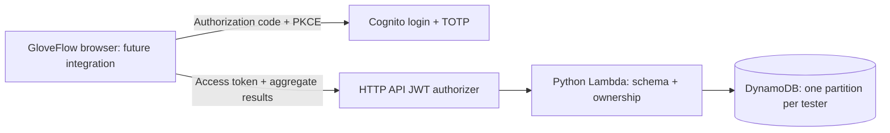

# GloveFlow Cloud

An authenticated API for saving **aggregate practice-session results** from GloveFlow. This is a separate backend source project; it has not been deployed or connected to the GloveFlow website.

The portfolio story is small and demonstrable: keep camera processing in the browser, save only measured task results, isolate every tester's records, and handle retries without duplicate sessions. No performance improvement or clinical outcome has been measured by this project yet.



## What is implemented

| Route | Behavior |
| --- | --- |
| `POST /sessions` | Create with a client-generated UUID. Identical retries return the original record; changed results with the same UUID return `409`. |
| `GET /sessions?limit=10&cursor=…` | List only the signed-in user's results; 1–25 records per page. |
| `DELETE /sessions/{session_id}` | Delete only the signed-in user's record. Missing IDs return the same `204`. |

Cognito's custom `gloveflow/sessions` scope is required on all routes. The authorizer verifies the token; Lambda checks its access-token type, client ID, subject, and scope again. The user ID always comes from verified claims. The app never accepts a user ID from the client.

The table stores a UUID, condition, measured duration, selection count, manually observed loss/error counts, simulation flag, and server receipt timestamp. The two internal keys bind the record to the tester's Cognito subject. Camera frames, hand landmarks, clinical data, names, email addresses, and free-text notes are not accepted by this API. Cognito separately stores tester sign-in information, including email.

## Run the local tests

From this directory:

```sh
python3 -m unittest discover -s tests -v
```

Tests use Python's standard library and mocked persistence. They need no AWS credentials, SDK installation, Docker, or network connection. Python 3.9+ runs the tests; the Lambda runtime is Python 3.12.

**Current result: 31 tests passed.** The SAM YAML also parses locally and contains 10 declared resources (10,212 bytes before SAM expansion). An independent source review found no confirmed defects. These checks do not establish that the stack will deploy: cfn-lint, CloudFormation Guard, SAM build, AWS change-set validation, hosted login, and live API tests remain pending. See [validation status](docs/VALIDATION.md).

## Read before connecting or deploying

- [API contract](docs/API.md): exact field limits, retries, pagination, and error responses.
- [Deployment review](docs/DEPLOYMENT.md): proposed AWS resources, costs, required choices, and commands for a later authorized deployment in **us-east-2**.
- [Teardown](docs/TEARDOWN.md): the table and tester pool are retained by default and need explicit removal for a complete cleanup.
- [Synthetic request fixture](examples/session.synthetic.json): API-shape example only; its numbers are not real test results or portfolio evidence.

The next implementation step is browser OAuth with PKCE and an explicit **Save session** action after a real timed exercise. That work is not included here. The current GloveFlow Site has not been changed.

## Design tradeoffs

Session IDs are random UUIDs, so listing is in stable UUID order, **not chronological order**. The response includes `created_at`; a small client can sort its loaded records. A future chronological index should be added only when the product needs it.

Idempotency lasts while the record exists. Deleting a record also removes its idempotency history; posting that UUID afterward creates a new record. Clients should generate a fresh UUID for each new exercise and reuse it only when retrying the same save.

The API is intended for an invited portfolio test group. It has low, best-effort request throttles and short log retention, but no hard per-user storage quota, automated data expiry, production alerting, or point-in-time recovery. Records persist until the user deletes them. The JWT authorizer can accept a valid access token until its 15-minute expiry even after sign-out or refresh-token revocation. This is an interaction research prototype, not a clinical system.

## Sources

The implementation follows official [SAM JWT authorizer configuration](https://docs.aws.amazon.com/serverless-application-model/latest/developerguide/sam-property-httpapi-oauth2authorizer.html), [HTTP API token validation](https://docs.aws.amazon.com/apigateway/latest/developerguide/http-api-jwt-authorizer.html), [Cognito client configuration](https://docs.aws.amazon.com/AWSCloudFormation/latest/TemplateReference/aws-resource-cognito-userpoolclient.html), [DynamoDB conditional writes](https://docs.aws.amazon.com/amazondynamodb/latest/developerguide/Expressions.ConditionExpressions.html), and [DynamoDB pagination](https://docs.aws.amazon.com/amazondynamodb/latest/developerguide/Query.Pagination.html).
